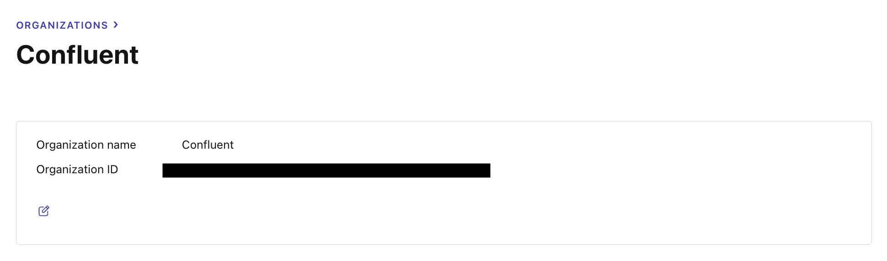

= Provisioning Confluent Cloud Infrastructure

Let's assume you have completed the following prereqs:

* https://confluent.cloud[Confluent Cloud Account]
* https://docs.confluent.io/confluent-cli/current/install.html[Confluent CLI]
* https://www.terraform.io/[Terraform]
* https://jqlang.github.io/jq/[jq]

== Shell Setup

Log into Confluent Cloud and find the API Key and API Secret. 
Use the commands below to set environment variables needed to authenticate to Confluent Cloud:

```shell
export CONFLUENT_CLOUD_API_KEY=<API KEY>
export CONFLUENT_CLOUD_API_SECRET=<API SECRET>
```

== Execute Terraform Manifests

The terraform manifests require the Confluent Cloud organization ID in order to provision infrastructure. 
This can be found in the Confluent Cloud console in the "Organization Settings" and exported to an environment variable:

image::org-id.jpg[]



```bash
export TF_VAR_org_id=<ORG ID VALUE FROM CONSOLE>
```

This value can also be queried by using the Confluent CLI to query your account, piping the result to a `jq` query and using that value in a `TF_VAR_`:

```bash
export TF_VAR_org_id=$(confluent organization list -o json | jq -c -r '.[] | select(.is_current)' | jq '.id')
```

From this directory, execute the following commands:

```bash
terraform init 					
terraform plan -out "tfplan" 			
terraform apply 					
```

Once completed, verify the infrastructure is created in the Confluent Cloud console.

== Using Infrastructure in the Workshop

In the Table API exercises, we will need API keys and secrets to connect Flink to Confluent Cloud. 
This `terraform output` command will create a file with those parameters:

```bash
terraform output -json \
 | jq -r 'to_entries | map( {key: .key|tostring|split("_")|join("."), value: .value} ) | map("\(.key)=\(.value.value)") | .[]' \
 | while read -r line ; do echo "$line"; done > ../common/utils/src/main/resources/cloud.properties
```

== Teardown

When the workshop is complete, run the following command to destroy all Confluent Cloud assets:

```bash
terraform destroy --auto-approve
```
